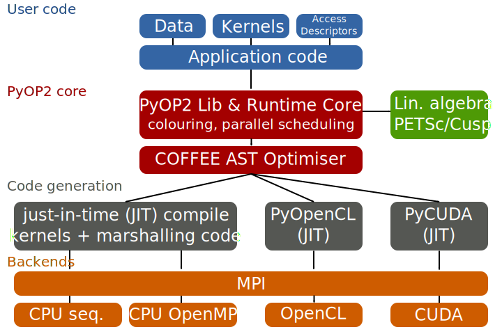
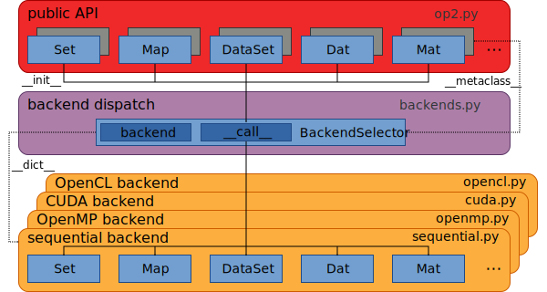
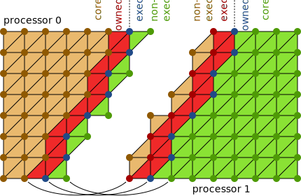

class: center, middle, inverse

# Solving partial differential equations using the finite element method efficiently and productively with Firedrake and PyOP2

## http://firedrakeproject.org

## **Florian Rathgeber**<sup>0</sup>, Lawrence Mitchell<sup>1</sup>, David Ham<sup>1,2</sup>, Michael Lange<sup>3</sup>, Andrew McRae<sup>2</sup>, Fabio Luporini<sup>1</sup>, Gheorghe-teodor Bercea<sup>1</sup>, Paul Kelly<sup>1</sup>

Slides: http://kynan.github.io/FiredrakeECMWFSeminar

.footnote[<sup>0</sup> Data Handling Team, Development Section, Forecast Department, ECMWF  
<sup>1</sup> Department of Computing, Imperial College London  
<sup>2</sup> Department of Mathematics, Imperial College London  
<sup>3</sup> Department of Earth Science & Engineering, Imperial College London]

---

background-image:url(images/fem.svg)

---

## Solving the Helmholtz equation in Python using Firedrake

`$$\int_\Omega \nabla v \cdot \nabla u - \lambda v u ~dV = \int_\Omega v f ~dV$$`

```python
from firedrake import *

# Read a mesh and define a function space
mesh = Mesh('filename')
V = FunctionSpace(mesh, "Lagrange", 1)

# Define forcing function for right-hand side
f = Expression("- (lmbda + 2*(n**2)*pi**2) * sin(X[0]*pi*n) * sin(X[1]*pi*n)", lmbda=1, n=8)

# Set up the Finite-element weak forms
*u = TrialFunction(V)
*v = TestFunction(V)

*lmbda = 1
*a = (dot(grad(v), grad(u)) - lmbda * v * u) * dx
*L = v * f * dx

# Solve the resulting finite-element equation
p = Function(V)
solve(a == L, p)
```

[Unified Form Language (UFL)](https://bitbucket.org/fenics-project/ufl)
from the [FEniCS project](http://fenicsproject.org) to describe weak
form of PDE

???

Now how do we use Firedrake to solve such a PDE?

As a mathematician you write down the equation in what is called the
weak form. Firedrake uses the Unified Form Language from the FEniCS
project to express this weak form in Python as almost literal
transcription (the highlighted bit).

The entire code the user needs to write to solve this PDE is what you
see on the slide:
* read geometry (mesh) from file
* define the PDE
* solve it

To anyone familiar with the FEniCS project this will be familiar:
Firedrake intentionally implements the same API.

The solve is of course where the magic happens and we'll get to that.

---

class: middle
.scale[]

> Firedrake is an automated system for the portable solution of partial
> differential equations using the finite element method (FEM).
>
> .source[&mdash; firedrakeproject.org]

---

.left-column[
## The Firedrake/PyOP2 tool chain
]
.right-column[
.scale[]
]

???

Two-layer abstraction for FEM computation from high-level descriptions:
* Firedrake: a portable finite-element computation framework  
  *Drive FE computations from a high-level problem specification*
* PyOP2: a high-level interface to unstructured mesh based methods  
  *Efficiently execute kernels over an unstructured grid in parallel*

The key concept is a layering of abstractions, with Firedrake as a portable
finite-element computation framework on top, allowing to drive computations from
a very high-level problem specification. The lower layer is PyOP2, a framework
for unstructured mesh computations, whose role is to efficiently execute kernels
over an unstructured mesh in parallel.

This diagram shows an overview of the Firedrake / PyOP2 toolchain:

* Decoupling of Firedrake (FEM) and PyOP2 (parallelisation) layers
* (mostly) DOLFIN compatible API
* UFL to describe finite-element discretisation
* PETSc for linear/nonlinear solvers and mesh building / distribution
* Platform-specific runtime code generation and JIT compilation
* Portability for unstructured mesh applications: FEM, non-FEM or combinations
* Extensible framework beyond FEM computations (e.g. image processing)
* Revisit this diagram later

---

.left-column[
## Two-layered abstraction: Separation of concerns
]
.right-column[
.scale[]
]

???

Separating the problem into two abstraction layers gives us a real
separation of concerns: contributors can work only in their area of
expertise without having to be concerned, or even familiar, with the
other layer.

This is not just a theory, this is how we actually work in our research
group! We have mathematicians in the group how are deeply familiar with
the FEM and work on e.g. adding support for further discretisations but
have little expertise with computer architecture or parallel programming
- and don't need to! On the other hand we have compiler experts who
reason about optimising kernels as abstract loop nests without needing
to know or care where those kernels come from.

---

class: center, middle
# Parallel computations on unstructured meshes with PyOP2

???

Let's start at the bottom layer and look at parallel computations on
unstructured meshes with PyOP2.

---

## Unstructured mesh


.pull-left[
## Scientific computations on unstructured meshes

* Independent *local operations* for each element of the mesh described by a *kernel*.
* *Reductions* aggregate contributions from local operations to produce final result.
]
.pull-right[
## PyOP2

* Domain-specific language embedded in Python for data parallel computations
* Efficiently executes kernels in parallel over unstructured meshes or graphs
* Portable programmes for different architectures without code change
* Efficiency through runtime code generation and just-in-time (JIT) compilation
]

???

FEM is an example of a class of scientific computations on unstructured meshes
characterised by *independent local operations* that need to be performed *for
every entity of the mesh* and can be described by a *computational kernel*.
Some operations are followed by a *reduction* which aggregates contributions
from these local operations. In FEM that is the assembly of the sparse linear
system.

PyOP2 is a domain-specific language embedded in Python which abstracts
this concept and allows writing portable programmes which efficiently
run on different platforms without any changes to the source. How do we
do this using Python, which you might think is slow?

Portability and efficiency is achieved through generating platform- and
problem-specific code at runtime, just-in-time compiling it and executing it
natively for the chosen architecture.

Why at runtime? No need for analysis / parsing code (the hard part),
only sythesis / generating code (the easy part). All the information is
available, just execute the code, reason about and introspect the
(Python) objects!

---

## PyOP2 Data Model


.pull-left[
### Mesh topology
* ``Sets`` – Mesh entities and data DOFs
* ``Maps`` – Define connectivity between entities in different ``Sets``

### Data
* ``Dats`` – Defined on ``Sets`` (hold data, completely abstracted vector)
* ``Globals`` – not associated to a ``Set`` (reduction variables, parameters)
* ``Consts`` – Global, read-only data
]

.pull-right[
### Kernels / parallel loops
* Executed in parallel on a ``Set`` through a parallel loop
* Read / write / increment data accessed via maps

### Linear algebra
* ``Sparsity`` patterns defined by ``Maps``
* ``Mat`` – Matrix data on sparsities
* Kernels compute local matrix – PyOP2 handles global assembly
]

???

PyOP2 uses a number of simple primitives to describe unstructured meshes and
data defined on them:
* Set: abstractly defines class of entities, only know how big it is
* Map: defines connectivity between elements of sets (mesh topology)
  * conceptually a "data parallel pointer"
  * lookup table: which entities of the target Set associated
    with an entitity of the source Set
* Dat: abstracted array, defined on a Set, contains actual values
  * Data can live in  CPU or GPU memory, partitioned for distributed parallel
  * PyOP2 manages storage, layout, access, transfer, halo exchange
  * "data parallel data"
  * mostly opaque
  * use like a vector: linear algebra operations
* Kernels / parallel loops:
  * kernels: define operations/computations to be performed independently for
    every entity of a given Set.
  * executed over iteration Set (or subset) in parallel (parallel loop)
  * sequential semantics, local view of the data, defined by access descriptors
  * indirect data access via Maps (one level of indirection): abstracted from
    kernel
* Linear algebra:
  * Parallel loops can assemble matrices from local assembly kernel
  * Matrix defined on sparsity, which are defined by pairs of Maps
  * PyOP2 takes care of global assembly (reduction)
* take home
  * PyOP2 objects are bare/simple objects with powerful semantics
  * tools to express higher-level objects/constructs e.g. FEM

---

.left-column[
## PyOP2 Architecture
]
.right-column[
.scale[]
]

???

Now that we've introduced the concepts, how does it work?

PyOP2 architecture shown in this diagram:
* Provides unified API to the user (which may be another program, e.g. Firedrake)
* Declare data types, exectute parallel loops ("smart" dynamic construct)
* PyOP2 runtime schedules computation efficiently (colouring avoids data races)
* kernels executed over the mesh in native code
* code generated and JIT compiled at runtime for different backends
* 4 backends, backend-specific JIT compilation tool chain
* CPU JIT: shell out to compiler to compile generated kernel + marshalling code
* use ctypes to load the compiled shared object
* 3rd party libraries (CPU: PETSc, GPU: Cusp) for sparse matrices, linear solvers

---

.scale[]

---

.left-column[
## PyOP2 Kernels & Parallel Loops

Kernels:
* "local view" of the data
* sequential semantics

Parallel loop:
* use access descriptors to generate marshalling code
* pass "right data" to kernel for each iteration set element
]
.right-column[
### Kernel for computing the midpoint of a triangle

```c
void midpoint(double p[2], double *coords[2]) {
  p[0] = (coords[0][0] + coords[1][0] + coords[2][0]) / 3.0;
  p[1] = (coords[0][1] + coords[1][1] + coords[2][1]) / 3.0;
}
```

### PyOP2 programme for computing midpoints over the mesh

```python
from pyop2 import op2
op2.init()

vertices = op2.Set(num_vertices)
cells = op2.Set(num_cells)

cell2vertex = op2.Map(cells, vertices, 3, [...])

coordinates = op2.Dat(vertices ** 2, [...], dtype=float)
midpoints = op2.Dat(cells ** 2, dtype=float)

midpoint = op2.Kernel(kernel_code, "midpoint")

*op2.par_loop(midpoint, cells,
*             midpoints(op2.WRITE),
*             coordinates(op2.READ, cell2vertex))
```

Kernels as abstract syntax tree (AST), C string or Python function
(not currently compiled!)
]

???

Simple example programme: compute midpoint of all cells in mesh
* kernel: typically generated (by FFC in case of Firedrake or e.g.
  SymPy), specified as AST or C string ("back door")
* can perform backend specific optimisations on AST
* kernel: local view of the data, sequential semantics
* parallel loop arguments: kernel, iteration set + access descriptors
* access descriptors match kernel parameters, define local view for the kernel

---

## Generated sequential code calling the midpoint kernel

```c
// Kernel provided by the user
static inline void midpoint(double p[2], double *coords[2]) {
  p[0] = (coords[0][0] + coords[1][0] + coords[2][0]) / 3.0;
  p[1] = (coords[0][1] + coords[1][1] + coords[2][1]) / 3.0;
}

// Generated marshaling code executing the sequential loop
void wrap_midpoint(int start, int end,
                   double *arg0_0, double *arg1_0, int *arg1_0_map0_0) {
  double *arg1_0_vec[3];
  for ( int n = start; n < end; n++ ) {
    arg1_0_vec[0] = arg1_0 + (arg1_0_map0_0[n * 3 + 0])* 2;
    arg1_0_vec[1] = arg1_0 + (arg1_0_map0_0[n * 3 + 1])* 2;
    arg1_0_vec[2] = arg1_0 + (arg1_0_map0_0[n * 3 + 2])* 2;
*    midpoint(arg0_0 + n * 2, arg1_0_vec);  // call user kernel (inline)
  }
}
```

---

## Generated OpenMP code calling the midpoint kernel

```c
// Kernel provided by the user
static inline void midpoint(double p[2], double *coords[2]) {
  p[0] = (coords[0][0] + coords[1][0] + coords[2][0]) / 3.0;
  p[1] = (coords[0][1] + coords[1][1] + coords[2][1]) / 3.0;
}

// Generated marshaling code executing the parallel loop
void wrap_midpoint(int boffset, int nblocks, int *blkmap, int *offset, int *nelems,
                   double *arg0_0, double *arg1_0, int *arg1_0_map0_0) {
  #pragma omp parallel shared(boffset, nblocks, nelems, blkmap) {
    int tid = omp_get_thread_num();
    double *arg1_0_vec[3];
    #pragma omp for schedule(static)
    for ( int __b = boffset; __b < boffset + nblocks; __b++ ) {
      int bid = blkmap[__b];
      int nelem = nelems[bid];
      int efirst = offset[bid];
      for (int n = efirst; n < efirst+ nelem; n++ ) {
        arg1_0_vec[0] = arg1_0 + (arg1_0_map0_0[n * 3 + 0])* 2;
        arg1_0_vec[1] = arg1_0 + (arg1_0_map0_0[n * 3 + 1])* 2;
        arg1_0_vec[2] = arg1_0 + (arg1_0_map0_0[n * 3 + 2])* 2;
*        midpoint(arg0_0 + n * 2, arg1_0_vec);  // call user kernel (inline)
      }
    }
  }
}
```

---

.scale[]

---

class: center, middle

# Finite-element computations with Firedrake

???

How can Firedrake make use of that for FE computations?

---

.left70[
## Firedrake concepts
.scale[]
]

.right30[
### Function
Field defined on a set of degrees of freedom (DoFs), data stored as PyOP2 `Dat`
### FunctionSpace
Characterized by a family and degree of FE basis functions, defines DOFs for function and relationship to mesh entities
### Mesh
Defines abstract topology by sets of entities and maps between them (PyOP2 data structures)
]

???

Firedrake uses same concepts of Functions defined on FunctionSpaces defined on a
Mesh as DOLFIN, however all of these are implemented in terms of the PyOP2 data
structures I showed earlier:
* Function's data stored as PyOP2 Dat (Firedrake does not directly touch field
    data!)
* Dat defined on the DOFs DataSet of the FunctionSpace (defined on the nodes Set)
* nodes Set related to Sets of cells, exterior/interior facets of the Mesh via Maps

---

## Driving Finite-element Computations in Firedrake

Solving the Helmholtz equation in Python using Firedrake:
`$$\int_\Omega \nabla v \cdot \nabla u - \lambda v u ~dV = \int_\Omega v f ~dV$$`

```python
from firedrake import *

# Read a mesh and define a function space
mesh = Mesh('filename')
V = FunctionSpace(mesh, "Lagrange", 1)

# Define forcing function for right-hand side
f = Expression("- (lmbda + 2*(n**2)*pi**2) * sin(X[0]*pi*n) * sin(X[1]*pi*n)", lmbda=1, n=8)

# Set up the Finite-element weak forms
u = TrialFunction(V)
v = TestFunction(V)

lmbda = 1
a = (dot(grad(v), grad(u)) - lmbda * v * u) * dx
L = v * f * dx

# Solve the resulting finite-element equation
p = Function(V)
*solve(a == L, p)
```

???

Now that we've discussed the concepts, let's look at how to drive FE
computations in Firedrake

This slide shows the code for solving the Helmholtz equation and should be
familiar to any DOLFIN user modulo the import from Firedrake.

---

.left-column[
## Helmholtz local assembly kernel generated by FFC

The [FEniCS Form Compiler](https://bitbucket.org/fenics-project/ffc) FFC compiles UFL forms to low-level code.
]
.right-column[
### Weak form of the Helmholtz equation and corresponding UFL form

`$$\int_\Omega \nabla v \cdot \nabla u - \lambda v u ~dV = \int_\Omega v f ~dV$$`

```python
a = (dot(grad(v), grad(u)) - lmbda * v * u) * dx
```

### FFC-generated C kernel (2D triangle mesh)
```c
// A - local tensor to assemble
// x - local coordinates
// j, k - 2D indices into the local assembly matrix
void kernel(double A[1][1], double *x[2],
            int j, int k) {
  // FE0 - Shape functions
  // Dij - Shape function derivatives
  // Kij - Jacobian inverse / determinant
  // W3  - Quadrature weights
  // det - Jacobian determinant
  for (unsigned int ip = 0; ip < 3; ip++) {
    A[0][0] += (FE0[ip][j] * FE0[ip][k] * (-1.0)
      + (((K00 * D10[ip][j] + K10 * D01[ip][j]))
        *((K00 * D10[ip][k] + K10 * D01[ip][k]))
      +  ((K01 * D10[ip][j] + K11 * D01[ip][j]))
        *((K01 * D10[ip][k] + K11 * D01[ip][k]))))*W3[ip]*det;
  }
}
```
]

---

## Behind the scenes of the solve call

* Firedrake always solves nonlinear problems in resdiual form `F(u;v) = 0`
* Transform linear problem into residual form:
  ```python
  J = a
  F = ufl.action(J, u) - L
  ```
  * Jacobian known to be `a`
  * **Always** solved in a single Newton (nonlinear) iteration
* Use Newton-like methods from PETSc SNES (optimised C library)
* PETSc SNES requires two callbacks to evaluate residual and Jacobian:
  * implemented as Python functiones (supported by petsc4py)
  * evaluate residual by assembling residual form
    ```python
    assemble(F, tensor=F_tensor)
    ```
  * evaluate Jacobian by assembling Jacobian form
    ```python
    assemble(J, tensor=J_tensor, bcs=bcs)
    ```
  * `assemble` invokes PyOP2 with kernels generated from `F` and `J`

???

* What happens when the final solve is called on the previous slide?
* Unified solving interface even behind the scenes

* If Jacobian not provided by the user, Firedrake uses automatic differentiation:
  ```python
  J = ufl.derivative(F, u)
  ```
* Kernels generated by FFC and executed as PyOP2 parallel loops
  * Firedrake builds PyOP2 parallel loop call, using FFC-generated kernel
  * iterate over cells (for cell integrals) or facets (interior/exterior facet integrals)
  * output tensor depends on rank of the form (PyOP2 `Mat`, `Dat` or `Global`)
  * input arguments: coordinate field and any coefficients present in the form

---
name: bcs

## Applying boundary conditions

* Always preserve symmetry of the operator
* Avoid costly search of CSR structure to zero rows/columns
* Zeroing during assembly, but requires boundary DOFs:
  * negative row/column indices for boundary DOFs during addto
  * instructs PETSc to drop entry, leaving 0 in assembled matrix

???

* How can we call assembly before knowing final BCs?
* BCs may change between point of assembly and solve
* assembly returns unassembled matrix with assembly "thunk" (recipe), called with BCs when solving
* Assembly is cached
  * pre-assembly not required in most circumstances
  * Matrices record BCs they have been assembled with, no need for reassembly
  * assembly cache has FIFO eviction strategy

---
template: bcs

## Preassembly

```python
A = assemble(a)
b = assemble(L)
solve(A, p, b, bcs=bcs)
```

---
template: bcs

## Preassembly

```python
*A = assemble(a)  # A unassembled, A.thunk(bcs) not yet called
b = assemble(L)
solve(A, p, b, bcs=bcs)
```

---
template: bcs

## Preassembly

```python
A = assemble(a)  # A unassembled, A.thunk(bcs) not yet called
b = assemble(L)
*solve(A, p, b, bcs=bcs)  # A.thunk(bcs) called, A assembled
```

---
template: bcs

## Preassembly

```python
A = assemble(a)  # A unassembled, A.thunk(bcs) not yet called
b = assemble(L)
solve(A, p, b, bcs=bcs)  # A.thunk(bcs) called, A assembled
# ...
*solve(A, p, b, bcs=bcs)  # bcs consistent, no need to reassemble
```

---
template: bcs

## Preassembly

```python
A = assemble(a)  # A unassembled, A.thunk(bcs) not yet called
b = assemble(L)
solve(A, p, b, bcs=bcs)  # A.thunk(bcs) called, A assembled
# ...
solve(A, p, b, bcs=bcs)  # bcs consistent, no need to reassemble
# ...
*solve(A, p, b, bcs=bcs2)  # bcs differ, reassemble, call A.thunk(bcs2)
```

---

.left-column[
## Distributed Parallel Computations with MPI
]
.right-column[
.scale[]
]

???

* Enforce constraint on local mesh numbering for efficient comp-comm overlap
* Local mesh entities partioned into four consecutive sections
  * **Core:** Entities owned by this processor which can be processed without
    accessing halo data.
  * **Owned:** Entities owned by this processor which access halo data when
    processed.
  * **Exec halo:** Off-processor entities redundantly executed over
    because they touch owned entities.
  * **Non-exec halo:** Off-processor entities which are not processed, but
    read when computing the exec halo.
* Computations on boundaries require up-to-date *halo* data
* Entities that do not touch the boundary (core entities, by construction) can
  be computed while halo data exchange is in flight
* Halo exchange is automatic and happens only if halo is "dirty"

---

## How do Firedrake/PyOP2 achieve good performance?

* No computationally expensive computations (inner loops) in pure Python
* Call optimised libraries where possible (PETSc)
* Expensive library code implemented in Cython (sparsity builder)
* Kernel application over the mesh in natively generated code
* Python is not just glue!

### Caching

* Firedrake
  * Assembled operators
  * Function spaces cached on meshes
  * FFC-generated kernel code
* PyOP2
  * ``Maps`` cached on ``Sets``
  * Sparsity patterns
  * JIT-compiled code
* Only data isn't cached (``Function``/``Dat``)

---

## Summary and additional features

### Summary
* Two-layer abstraction for FEM computation from high-level descriptions
  * Firedrake: a performance-portable finite-element computation framework  
    *Drive FE computations from a high-level problem specification*
  * PyOP2: a high-level interface to unstructured mesh based methods  
    *Efficiently execute kernels over an unstructured grid in parallel*
* Decoupling of Firedrake (FEM) and PyOP2 (parallelisation) layers
* Firedrake concepts implemented with PyOP2/PETSc constructs
* Portability for unstructured mesh applications: FEM, non-FEM or combinations
* Extensible framework beyond FEM computations (e.g. image processing)

--

### Preview: Firedrake features not covered
* Automatic optimization of generated assembly kernels with COFFEE
* Solving PDEs on extruded (semi-structured) meshes
* Building meshes using PETSc DMPlex
* Using fieldsplit preconditioners for mixed problems
* Solving PDEs on immersed manifolds
* ...

---

## Thank you!

Contact: [Florian Rathgeber](https://software.ecmwf.int/wiki/display/~mafr/), [@frathgeber](https://twitter.com/frathgeber), <florian.rathgeber@ecmwf.int>

## Resources

  * **PyOP2** https://github.com/OP2/PyOP2
    * *[PyOP2: A High-Level Framework for Performance-Portable Simulations on Unstructured Meshes](http://dx.doi.org/10.1109/SC.Companion.2012.134)*  
      Florian Rathgeber, Graham R. Markall, Lawrence Mitchell, Nicholas Loriant, David A. Ham, Carlo Bertolli, Paul H.J. Kelly,
      WOLFHPC 2012
    * *[Performance-Portable Finite Element Assembly Using PyOP2 and FEniCS](http://link.springer.com/chapter/10.1007/978-3-642-38750-0_21)*
       Graham R. Markall, Florian Rathgeber, Lawrence Mitchell, Nicolas Loriant, Carlo Bertolli, David A. Ham, Paul H. J. Kelly ,
       ISC 2013
  * **Firedrake** https://github.com/firedrakeproject/firedrake
    * *[Productive and Efficient Computational Science Through Domain-specific Abstractions](https://wwwhomes.doc.ic.ac.uk/~fr710/Rathgeber-F-2014-PhD-Thesis.pdf)*  
      Florian Rathgeber, PhD thesis, October 2014
    * *[COFFEE: an Optimizing Compiler for Finite Element Local Assembly](http://arxiv.org/abs/1407.0904)*
      Fabio Luporini, Ana Lucia Varbanescu, Florian Rathgeber, Gheorghe-Teodor Bercea, J. Ramanujam, David A. Ham, Paul H. J. Kelly,
      submitted
  * **UFL** https://bitbucket.org/mapdes/ufl
  * **FFC** https://bitbucket.org/mapdes/ffc

**This talk** is available at http://kynan.github.io/FiredrakeSeminarECMWF ([source](https://github.com/kynan/FiredrakeSeminarECMWF)) &bullet; slides created with [remark](https://github.com/gnab/remark)
